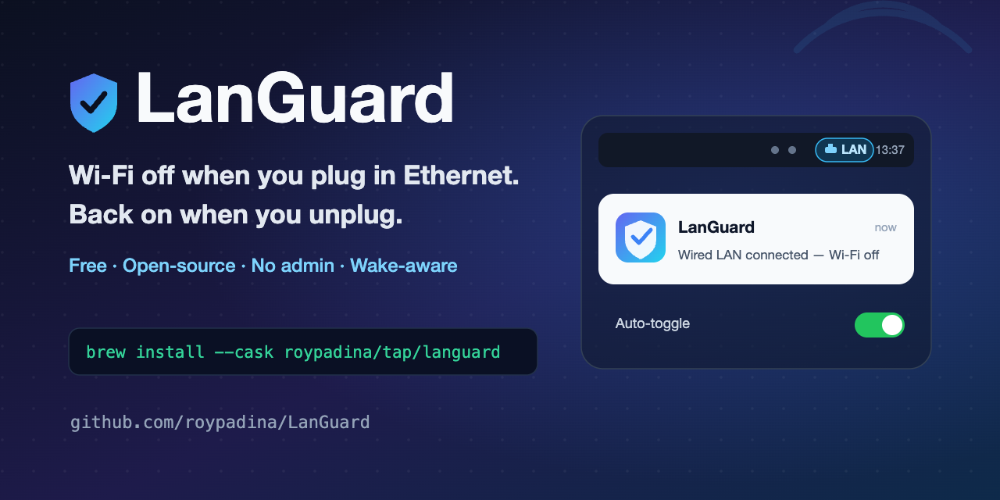
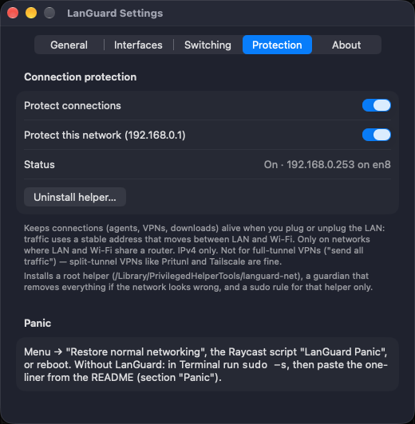

<div align="center">



# LanGuard

### Wi-Fi off when you're wired. Back on when you're not.

A tiny native macOS menu-bar app that turns **Wi-Fi off the moment a wired LAN link goes up**,
and back **on when you unplug** — edge-based, wake-aware, per-interface, and no admin rights required.

[](https://www.apple.com/macos/)
[](https://swift.org)
[](https://github.com/roypadina/homebrew-tap)
[](https://github.com/roypadina/LanGuard/releases/latest)
[](https://github.com/roypadina/LanGuard/actions/workflows/ci.yml)
[](LICENSE)
[](CONTRIBUTING.md)
[](https://github.com/roypadina/LanGuard/stargazers)
[](https://ko-fi.com/roypadina)

<br>


<sub><i>Wired link goes up → indicator flips to <b>LAN</b> and Wi-Fi powers off · link goes down → back to <b>Wi-Fi</b>.</i></sub>

</div>

---

## Table of Contents

- [Why](#why)
- [Features](#features)
- [How LanGuard compares](#how-languard-compares)
- [Install](#install)
- [Usage](#usage)
- [How it works](#how-it-works)
- [Is it safe?](#is-it-safe)
- [FAQ](#faq)
- [Uninstall](#uninstall)
- [Reporting a bug](#reporting-a-bug)
- [Contributing](#contributing)
- [Support](#support)
- [License](#license)

## Why

macOS keeps Wi-Fi on even when you're docked over Ethernet — wasting an IP lease, adding a
second default route, sometimes sending traffic out the wrong interface, and leaving an extra
radio exposed. LanGuard switches Wi-Fi **off** the instant a wired link is active and switches
it back **on** when the cable's gone. It only acts on plug/unplug **transitions**, so if you
manually flip Wi-Fi back on while docked, it stays on until you next unplug.

## Features

| | |
|---|---|
| 🔌 **Edge-based** | Acts only on wired plug/unplug transitions — your manual Wi-Fi changes are respected. |
| 😴 **Wake-aware** | A transition that happened while asleep is detected and corrected on wake. |
| 🎛️ **Per-interface** | Pick which wired adapters trigger and which Wi-Fi adapters are controlled. |
| 🧪 **Ignores virtual NICs** | Bridge / VPN / VM adapters (e.g. VMware `vmnet`) are off by default so they can't pin Wi-Fi off. |
| 🤝 **No-drop hand-over** | Plug in LAN: Wi-Fi stays on until the LAN reaches the internet and Wi-Fi traffic goes quiet, then turns off. |
| ⌨️ **Switch to Wi-Fi** | Menu or a global shortcut (default `⌃⌥⌘L`, record your own in Settings) before unplugging: Wi-Fi on, traffic moved to it with a live progress window, then a "safe to unplug LAN" popup. |
| 🔔 **Notifications** | Each banner / popup can be switched on or off in Settings. |
| 🧭 **Configurable indicator** | Menu-bar shows `LAN` / `Wi-Fi` / `Off` — icon only, icon + label, or label only. |
| ⏸️ **Master switch** | Pause all automatic toggling from the menu. |
| 🚀 **Start at login** | Self-healing login item — re-registers if the app moves; prompts if macOS needs approval. |
| 🔐 **No admin, no sudo** | Wi-Fi power via CoreWLAN, link state via SystemConfiguration. No network calls of its own. |

> **Menu-bar indicator** (icon + label style):
>
> 
>
> _An open-menu screenshot is still welcome — see [#1](https://github.com/roypadina/LanGuard/issues/1)._

## How LanGuard compares

|  | **LanGuard** | BridgeChecker | ToggleWifi |
|---|:---:|:---:|:---:|
| Price | **Free** | Paid (~$50) | Free |
| Open source | ✅ (MIT) | ❌ | ✅ |
| Per-interface selection | ✅ | ✅ | ❌ |
| Edge-based (respects manual toggle) | ✅ | — | — |
| Wake-from-sleep handling | ✅ | — | not documented |
| No admin / sudo | ✅ | — | ❌ (needs admin) |

<sub>Comparison based on each project's public docs at time of writing; verify current details on their sites. LanGuard is **not** notarized (ad-hoc signed) — see [Is it safe?](#is-it-safe).</sub>

## Install

> **Requires macOS 14+ (Sonoma).**

### Homebrew

```bash
brew install --cask roypadina/tap/languard
```

> LanGuard is ad-hoc signed (not notarized). On first launch, **right-click it in
> `/Applications` → Open** (then Open again), or run once:
> ```bash
> xattr -dr com.apple.quarantine "/Applications/LanGuard.app"
> ```
> See [Is it safe?](#is-it-safe) for why.

### Build from source

```bash
git clone https://github.com/roypadina/LanGuard.git
cd LanGuard
xcodebuild -workspace LanGuard.xcworkspace -scheme LanGuard -configuration Release build
cp -R ~/Library/Developer/Xcode/DerivedData/LanGuard-*/Build/Products/Release/LanGuard.app /Applications/
open /Applications/LanGuard.app
```

The app lives in the menu bar (no Dock icon). On first launch, click **Allow** on the
notification prompt if you want toggle banners.

## Usage

Click the menu-bar icon for status, the **Auto-toggle** master switch, and **Settings…**.

In **Settings** you can:
- choose which **wired adapters** count as triggers (real adapters on by default, virtual off),
- choose which **Wi-Fi adapters** are controlled,
- toggle each **notification** (Wi-Fi off / Wi-Fi back on banners, progress window, "safe to unplug" popup),
- record the **Switch to Wi-Fi shortcut**,
- allow **moving traffic before unplug** (one admin prompt installs a sudo rule limited to `networksetup -ordernetworkservices`),
- pick the **menu-bar icon style** (icon / icon + label / label),
- enable **Start at login**.

<div align="center">



</div>

## How it works

```
wired link UP   ─▶  Wi-Fi OFF
wired link DOWN ─▶  Wi-Fi ON
(no edge)       ─▶  leave Wi-Fi alone   ← respects manual override
```

| Component | Role |
|---|---|
| `NetworkMonitor` | `SCDynamicStore` link/IP callbacks + `NSWorkspace` wake notification |
| `WiFiController` | CoreWLAN power on/off (no sudo) |
| `ToggleEngine`   | Edge state machine — dependency-injected, fully unit-tested |
| `InterfaceCatalog` | Enumerate + classify Ethernet/Wi-Fi; flag virtual adapters |
| `LoginItem` | `SMAppService` login item (self-healing) |
| `Notifier` | `UNUserNotificationCenter` banners |

See the [Wiki](https://github.com/roypadina/LanGuard/wiki) for deeper docs,
[`CHANGELOG.md`](CHANGELOG.md) for release history, and [`CLAUDE.md`](CLAUDE.md) for the
full component map.

## Connection protection & Panic

Optional (Settings → Connection protection, off by default). LanGuard keeps a stable address that moves
between LAN and Wi-Fi, so connections (agents, VPNs, downloads) survive plugging/unplugging the cable.
It only applies on networks where LAN and Wi-Fi share a router. Everything it changes is one extra
address plus two routes (`0.0.0.0/1`, `128.0.0.0/1`) — nothing persistent; a reboot clears it.
A root guardian checks every ~3 s and removes everything when the network looks wrong.
Limits: IPv4 only; needs DHCP on both LAN and Wi-Fi; don't combine with a full-tunnel VPN ("send all
traffic", e.g. OpenVPN `redirect-gateway`) — split-tunnel VPNs (Pritunl profiles with routes, Tailscale) work.
Pulling a whole dock removes its network adapter: VPN clients tied to it (e.g. Pritunl/OpenVPN) may
drop and need a manual reconnect; Claude Code, browsers and most apps carry on.
The first unplug on a new network is not protected yet: a network is learned once LAN and Wi-Fi are seen
on the same router (or tick "Protect this network").

**Panic — restore normal networking**, from easiest:
1. Menu bar → **⚠︎ Restore normal networking (panic)**.
2. Raycast script **LanGuard Panic** (works even if LanGuard is hung; asks for your password if needed).
3. Terminal, without LanGuard or its helper: run `sudo -s`, then paste:
   ```sh
   for n in 0.0.0.0/1 128.0.0.0/1; do i=$(route -n get -net $n 2>/dev/null | awk '$1=="interface:"{print $2}'); case $i in en[0-9]*) route -q -n delete -net $n;; esac; done; for i in $(ifconfig -l | tr ' ' '\n' | grep -E '^en[0-9]+$'); do p=$(ipconfig getifaddr $i); ifconfig $i | awk '/inet .* netmask 0xffffffff/{print $2}' | while read a; do [ "$a" != "$p" ] && ifconfig $i inet $a -alias; done; done; rm -f /var/run/languard-net.state; touch /var/run/languard-net.panic
   ```
4. Reboot.

Re-enable afterwards from the menu (**Re-enable connection protection**).

Quitting LanGuard does **not** turn protection off (so a quit, update or relaunch doesn't cut your
connections): the guardian keeps watching and the next launch takes over. While LanGuard is quit, an
unplug can't move the address, so the guardian removes it within seconds — connections on it drop and
networking falls back to normal. To turn protection off, use the Settings switch or panic.

## Is it safe?

Fair question — it toggles your network and launches at login. Here's the honest picture:

- **Open source (MIT).** Every line is in this repo; read or build it yourself.
- **No network calls of its own. No ads, no analytics, no tracking.** It uses local macOS
  networking APIs (CoreWLAN, SystemConfiguration). The only external tools it ever runs are
  read-only `ifconfig` (a link-state fallback) and a one-time `launchctl` to remove the legacy
  LaunchAgent — never `networksetup`, never with elevated privileges.
- **No admin / sudo.** It never asks for your password or installs a privileged helper (unless you enable the optional connection protection, which installs the root helper described above).
- **Ad-hoc signed, _not_ notarized.** That's the one rough edge: macOS can't verify the
  developer, so the first launch is blocked until you **right-click → Open** (or clear
  quarantine with the `xattr` command above). Notarization needs a paid Apple Developer ID;
  it's on the roadmap. If you'd rather not trust a prebuilt binary, **build from source**.
- Each release ships a **SHA-256** for the download so you can verify it.

## FAQ

**Wi-Fi turned back on by itself while I was docked — bug?**
No. LanGuard is *edge-based*: it acts only at the moment you plug/unplug. If you (or another
app) turn Wi-Fi on while wired, LanGuard respects that until your next unplug/replug.

**I'm docked but Wi-Fi stayed on.**
Either you turned it on manually since plugging in (see above), or that wired adapter isn't
selected as a trigger in Settings (virtual adapters are off by default).

**Does it work with USB-C / Thunderbolt docks and USB-Ethernet adapters?**
Yes — any adapter macOS reports as an Ethernet interface. You choose which ones count.

**Why is my VPN / VM adapter ignored?**
Virtual adapters (VPN tunnels, VMware/Parallels `vmnet`, bridges) are off by default so they
can't be mistaken for a real wired link. You can opt any of them in under Settings.

**Does it need admin rights?**
No. Wi-Fi power goes through CoreWLAN and link state through SystemConfiguration, both as your
normal user.

**macOS says it "can't verify the developer."**
It's not notarized yet — right-click the app → Open, or run the `xattr` command in
[Install](#install). See [Is it safe?](#is-it-safe).

## Uninstall

```bash
brew uninstall --cask languard          # if installed via Homebrew
# or just drag /Applications/LanGuard.app to the Trash

defaults delete com.roy.languard        # forget all settings (optional)
```
Also remove it under **System Settings → General → Login Items** if it's still listed.

## Reporting a bug

Hit something odd (Wi-Fi toggling when it shouldn't, etc.)? Turn on **Settings → Debug →
Enable debug logging**, reproduce it, then click **Reveal Logs in Finder** and attach
`~/Library/Logs/LanGuard/languard.log` to your [issue](https://github.com/roypadina/LanGuard/issues).
The log stays on your Mac and contains only interface names + toggle decisions (no personal data).

## Contributing

PRs welcome! `main` is protected — fork, branch, add tests, and open a PR. Good first issues are
[labeled here](https://github.com/roypadina/LanGuard/labels/good%20first%20issue). See
[CONTRIBUTING.md](CONTRIBUTING.md) and the [Code of Conduct](CODE_OF_CONDUCT.md).

```bash
cd LanGuardPackage && swift test   # pure logic, no hardware needed
```

## Support

If LanGuard keeps your Wi-Fi and wired connection from fighting each other, you can support its development — it's optional and always appreciated.

[](https://ko-fi.com/roypadina)

A ⭐ on the repo helps just as much.

## License

[MIT](LICENSE) © Roy Padina · [Support on Ko-fi ☕](https://ko-fi.com/roypadina)
